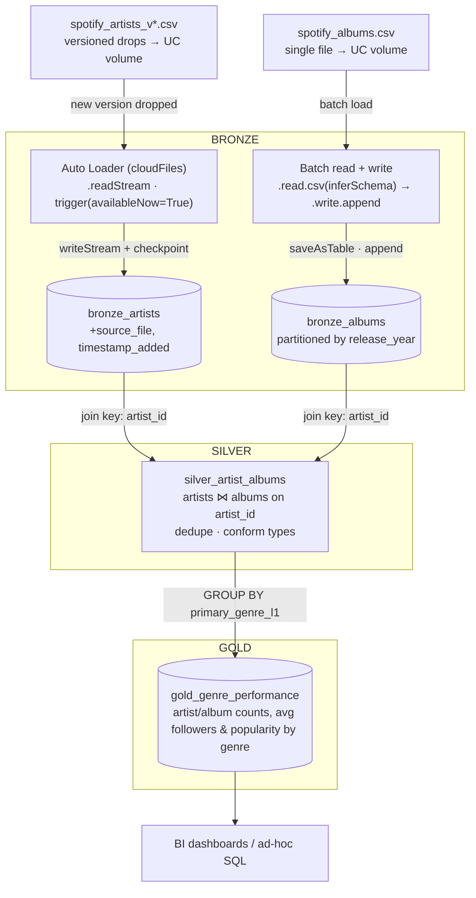

# Ingestion architecture

A medallion layout for the two Spotify sources landing in the Unity
Catalog volume: artist snapshots dropped as versioned CSVs, and a single
album export. Bronze keeps each source's ingestion pattern honest, silver
is where they meet, and gold answers one question well instead of many
questions poorly.

Two ingestion styles meet at silver: artists arrive incrementally through
Auto Loader as new versioned files land, albums arrive as a single batch
load. Silver joins them once on `artist_id`; gold is a plain aggregating
view on top, not another materialized copy.

## Layer reference

| Layer  | Object                   | Refresh                     | Grain                                            | Key logic                                                                |
|--------|--------------------------|------------------------------|---------------------------------------------------|---------------------------------------------------------------------------|
| Bronze | `bronze_artists`         | Streaming, `availableNow`    | 1 row per artist per source file                  | Schema inference + checkpoint; tags each row with `source_file`          |
| Bronze | `bronze_albums`          | Batch, append                 | 1 row per album                                   | Typed read, partitioned by `release_year`                                |
| Silver | `silver_artist_albums`   | Batch, after bronze lands     | 1 row per album, enriched with artist attributes  | Join on `artist_id`; dedupe; conform types; drop raw ingestion columns   |
| Gold   | `gold_genre_performance` | View, computed on read        | 1 row per genre                                   | Aggregates artist/album counts and average followers & popularity        |

Mirrors the current `static-tables` ingestion (Auto Loader for artists,
batch for albums) — silver and gold are the two layers this project
doesn't have yet.
