#spark #optimisation #delta-lake

## What is the transaction log?
- Every commit to a Delta table is written out as a **JSON file**
- The log is the source of truth for the table's current state (files, schema, metadata)

![[Pasted image 20260824165138.png]]

## The small-files problem
- Over time, Spark must read many tiny JSON commit files to resolve the current table state
- More commits → more JSON files → slower state resolution

![[Pasted image 20260824165618.png]]

## Checkpoints
- Databricks automatically writes a **Parquet checkpoint file every 10 commits**
- Spark then only needs to process the checkpoint plus any newer JSON files — **incremental** processing instead of replaying the full history

![[Pasted image 20260824165830.png]]

## Delta Lake file statistics
- For each added data file, the log captures:
  - **Total record count**
  - For the **first 32 columns** of the table: **min value**, **max value**, **null count**
- These stats power **file skipping** at query time

### Nested fields count toward the 32-column limit
- Struct fields are flattened — each nested leaf field counts as one of the 32
- Example: **4 struct fields × 8 nested fields each = 32 columns**, exactly filling the stats budget

```mermaid
graph TD
    T["Table Schema"] --> S1["struct_1"]
    T --> S2["struct_2"]
    T --> S3["struct_3"]
    T --> S4["struct_4"]

    S1 --> C1["field_1 · col 1"]
    S1 --> C2["field_2 · col 2"]
    S1 --> C3["field_3 · col 3"]
    S1 --> C4["field_4 · col 4"]
    S1 --> C5["field_5 · col 5"]
    S1 --> C6["field_6 · col 6"]
    S1 --> C7["field_7 · col 7"]
    S1 --> C8["field_8 · col 8"]

    S2 --> C9["field_1 · col 9"]
    S2 --> C10["field_2 · col 10"]
    S2 --> C11["field_3 · col 11"]
    S2 --> C12["field_4 · col 12"]
    S2 --> C13["field_5 · col 13"]
    S2 --> C14["field_6 · col 14"]
    S2 --> C15["field_7 · col 15"]
    S2 --> C16["field_8 · col 16"]

    S3 --> C17["field_1 · col 17"]
    S3 --> C18["field_2 · col 18"]
    S3 --> C19["field_3 · col 19"]
    S3 --> C20["field_4 · col 20"]
    S3 --> C21["field_5 · col 21"]
    S3 --> C22["field_6 · col 22"]
    S3 --> C23["field_7 · col 23"]
    S3 --> C24["field_8 · col 24"]

    S4 --> C25["field_1 · col 25"]
    S4 --> C26["field_2 · col 26"]
    S4 --> C27["field_3 · col 27"]
    S4 --> C28["field_4 · col 28"]
    S4 --> C29["field_5 · col 29"]
    S4 --> C30["field_6 · col 30"]
    S4 --> C31["field_7 · col 31"]
    S4 --> C32["field_8 · col 32"]

    style C32 fill:#f96,stroke:#333,stroke-width:2px
```



- **Caveat:** stats are ineffective for high-cardinality string columns (e.g. free-text fields) — move these outside the first 32 columns so they don't waste the stats budget

## Log retention period
- `VACUUM` does **not** delete Delta log files
- Log files are auto-cleaned by Databricks each time a checkpoint is written
- Entries older than **30 days** (default) are removed → time travel is limited to the last 30 days
- Configurable via `delta.logRetentionDuration`:

```sql
ALTER TABLE table_name
SET TBLPROPERTIES (delta.logRetentionDuration = 'interval 30 days')
```
