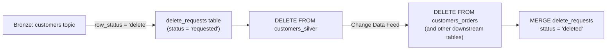

#streaming #delta-lake #cdc #privacy

## Right-to-be-forgotten pipeline

Delete requests arrive as CDC events on the Bronze `customers` topic (`row_status = 'delete'`). They're captured into a queue table, then propagated through Silver and out to every downstream table that references the customer.



## Step 1 — capture delete requests

```python
schema = "customer_id STRING, ... , row_status STRING, row_time timestamp"

(spark.readStream
    .table("bronze")
    .filter("topic = 'customers'")
    .select(F.from_json(F.col("value").cast("string"), schema).alias("v"))
    .select("v.*", F.col("v.row_time").alias("request_timestamp"))
    .filter("row_status = 'delete'")
    .select("customer_id", "request_timestamp",
            F.date_add("request_timestamp", 30).alias("deadline"),
            F.lit("requested").alias("status"))
 .writeStream
    .outputMode("append")
    .trigger(availableNow=True)
    .table("delete_requests")
)
```

- `deadline` (e.g. request + 30 days) tracks the SLA a regulation like GDPR imposes on honoring the request.
- `delete_requests` is itself an audit table of who asked to be forgotten and when it was actioned.

## Step 2 — delete from the source-of-truth (Silver)

```sql
DELETE FROM customers_silver
WHERE customer_id IN (SELECT customer_id FROM delete_requests WHERE status = 'requested')
```

## Step 3 — propagate via Change Data Feed

Reading `customers_silver`'s change feed lets every downstream/dependent table (orders, addresses, etc.) react to the delete without re-scanning the whole source table.

```python
deleteDF = (spark.readStream
    .format("delta")
    .option("readChangeFeed", "true")
    .option("startingVersion", 2)
    .table("customers_silver"))

def process_deletes(microBatchDF, batchId):
    microBatchDF.filter("_change_type = 'delete'").createOrReplaceTempView("deletes")

    microBatchDF.sparkSession.sql("""
        DELETE FROM customers_orders
        WHERE customer_id IN (SELECT customer_id FROM deletes)
    """)

    microBatchDF.sparkSession.sql("""
        MERGE INTO delete_requests r
        USING deletes d
        ON d.customer_id = r.customer_id
        WHEN MATCHED THEN UPDATE SET status = "deleted"
    """)

(deleteDF.writeStream
    .foreachBatch(process_deletes)
    .trigger(availableNow=True)
    .start())
```

- CDF, not a full table diff, is what makes this scale — `_change_type = 'delete'` isolates exactly the rows removed since `startingVersion`.
- Confirming a delete propagated: `SELECT * FROM customers_orders@v6 EXCEPT SELECT * FROM customers_orders`, or query the change feed directly and filter `_change_type = 'delete'`.

## ⚠️ N.B. — deleted PII is still visible after the `DELETE`

Running `DELETE`/`MERGE` against `customers_silver` removes the row from **current reads** of the table, but the PII does not disappear from storage at that point:

- **CDF still exposes it.** `table_changes(...)` / `readChangeFeed` returns the deleted row (as a `_change_type = 'delete'` record, including its full pre-image column values) for as long as change data is retained. Anyone with read access to the change feed can still see the "deleted" customer's data.
- **The Parquet files still hold it.** With [[Deletion Vectors]] enabled, `DELETE` doesn't rewrite the file — it just marks the row as removed via a small deletion-vector file. The physical bytes remain on disk until an `OPTIMIZE`/auto-compaction rewrite happens.
- **Time travel still exposes it.** Older table versions (`table@vN`) still contain the row until they age out of `delta.logRetentionDuration`.

**To actually purge the PII, `VACUUM` must be run on every affected table** (Silver + each downstream table CDF wrote deletes into) after the relevant retention window has passed:

```sql
VACUUM customers_silver;
VACUUM customers_orders;
```

- `VACUUM` physically removes files no longer referenced by the current table version *and* older than the retention threshold (default 7 days) — this is what removes the old Parquet files (and CDF change-data files) containing the deleted row.
- If GDPR-style SLAs are shorter than the default retention, lower `delta.deletedFileRetentionDuration` (and `delta.logRetentionDuration` for time travel) before vacuuming, otherwise `VACUUM` will refuse to delete files still inside the safety window.
- A deletion pipeline isn't "complete" at the `DELETE`/`MERGE` step — treat `VACUUM` as a required last stage whenever the deleted data is PII.
