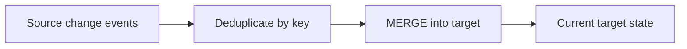
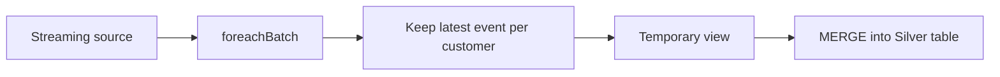
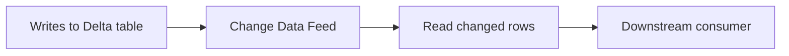
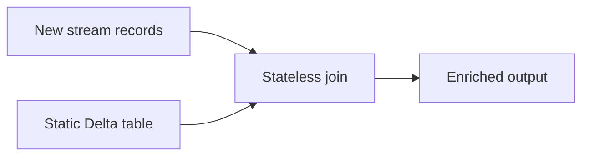
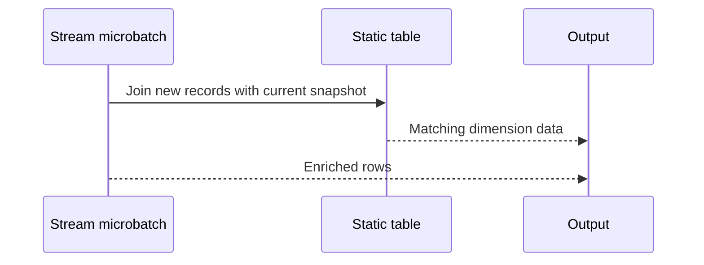

#streaming #ingestion #processing
# CDC — Change Data Capture

Change Data Capture (CDC) applies source changes—`INSERT`, `UPDATE`, and `DELETE`—to a target table.



## Key constraint

Each `MERGE` operation must have at most one source row matching a given target row. Multiple source rows for the same key can cause the merge to fail.

Before merging, keep only the latest event per key. Use a deterministic ordering column, such as a sequence number or event timestamp. If timestamps can tie, add a tie-breaker.

## Merge example

Place the delete condition before the update condition so that delete events are not treated as updates. `UPDATE SET *` and `INSERT *` require compatible source and target schemas.

```sql
MERGE INTO target_table AS t
USING source_updates AS s
ON t.key_field = s.key_field
WHEN MATCHED AND s.operation_field = 'DELETE' THEN DELETE
WHEN MATCHED AND s.sequence_field > t.sequence_field THEN UPDATE SET *
WHEN NOT MATCHED AND s.operation_field <> 'DELETE' THEN INSERT *;
```

## Streaming CDC

Arbitrary window operations are not supported directly on an unbounded streaming DataFrame. Run the deduplication within `foreachBatch`, where each microbatch is a bounded DataFrame.



```python
from pyspark.sql import functions as F
from pyspark.sql.window import Window


def batch_upsert(microbatch_df, batch_id):
    # Add a tie-breaker to orderBy if row_time is not unique.
    latest_per_customer = (
        microbatch_df
        .withColumn(
            "row_number",
            F.row_number().over(
                Window.partitionBy("customer_id").orderBy(F.col("row_time").desc())
            ),
        )
        .filter(F.col("row_number") == 1)
        .drop("row_number")
    )

    latest_per_customer.createOrReplaceTempView("latest_updates")

    microbatch_df.sparkSession.sql("""
        MERGE INTO customers_silver AS c
        USING latest_updates AS u
        ON c.customer_id = u.customer_id
        WHEN MATCHED AND u.operation = 'DELETE' THEN DELETE
        WHEN MATCHED AND u.row_time > c.row_time THEN UPDATE SET *
        WHEN NOT MATCHED AND u.operation <> 'DELETE' THEN INSERT *
    """)
```

Use the callback with a `foreachBatch` streaming write. Align `operation`, `row_time`, and the key column with the source schema.

---

# CDF — Change Data Feed

Change Data Feed (CDF) records row-level changes made to a Delta table. It provides changes for downstream consumers; it does not replace the CDC logic that produces or applies those changes.



![[assets/Pasted image 20260820093756.png]]

CDF is disabled by default. Enable it when creating a table or afterward with a table property:

```sql
ALTER TABLE table_name
SET TBLPROPERTIES (delta.enableChangeDataFeed = true);
```

To enable CDF by default for newly created Delta tables, set this Spark configuration to `true`:

```sql
SET spark.databricks.delta.properties.defaults.enableChangeDataFeed = true;
```

CDF data follows the table's retention policy. `VACUUM` can remove old change data, so downstream consumers must read it before the relevant retention period expires.

**N.B! Unity Cat.**

Use the table API—not the underlying files. Unity Catalog managed tables do not support path-based access, so `_delta_log` and `change_data` are implementation details, not a supported CDF interface. [Databricks UC paths](https://docs.databricks.com/aws/en/volumes/paths)

```
SELECT *
FROM table_changes('catalog.schema.target_table', <starting_version>);
```

Or Spark:

```
spark.read.option("readChangeFeed", "true") \
  .option("startingVersion", start_version) \
  .table("catalog.schema.target_table")
```

CDF returns `_change_type`, `_commit_version`, and `_commit_timestamp`. For legacy Delta CDF, it must have been enabled before the relevant changes; retained history is finite and may be removed by retention/VACUUM. [Databricks CDF documentation](https://docs.databricks.com/gcp/en/tables/features/change-data-feed)

For eligible UC Delta managed tables with row tracking on DBR 18 LTS+, consider automatic CDF: it uses the same APIs and computes changes at read time. [Automatic CDF requirements](https://docs.databricks.com/gcp/en/tables/features/change-data-feed#automatic-change-data-feed)

------

## Stream–static joins

A stream–static join enriches new stream records with a bounded lookup table, such as a customer or product dimension. It is stateless: Spark does not retain join state or require watermarks.



For each microbatch, the new stream records are joined with the latest valid version of the static Delta table. This is well suited to a slowly changing dimension table.



Updates to the static table do not recalculate output already produced. They affect only later microbatches that contain matching stream records. Reprocessing the same stream data after a static-table change can therefore produce different results; use a full refresh when historical output must reflect the new dimension values.

Supported join types depend on which side is streaming. With the stream on the left, inner, left outer, and left semi joins are supported; right and full outer joins are not. [Spark join support matrix](https://spark.apache.org/docs/3.5.6/structured-streaming-programming-guide.html) · [Databricks stream–static join semantics](https://docs.databricks.com/aws/en/transform/join)
